# Оптимизатор ПП

## Загрузка данных
В программу загружаются файлы с расширением .csv. По идее он должен считывать данные из любых видов csv-файлов, но если выдает ошибку - убедитесь в том, что значения записаны с точкой (0.1) и с запятой в качестве разделителя.  
Для наглядности строятся графики для всех переменных, также строится тепловая карта, на которой видно корреляции между параметрами.  

  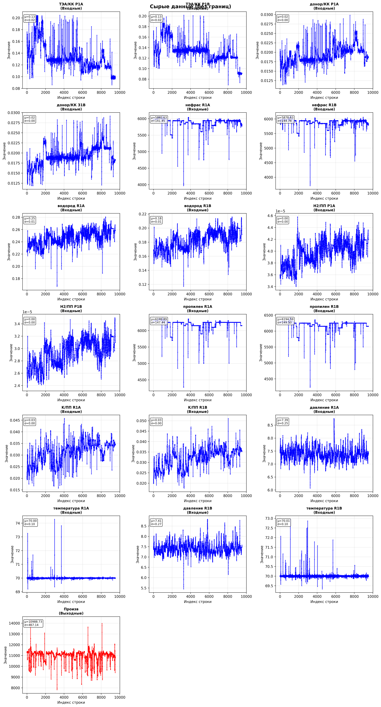

  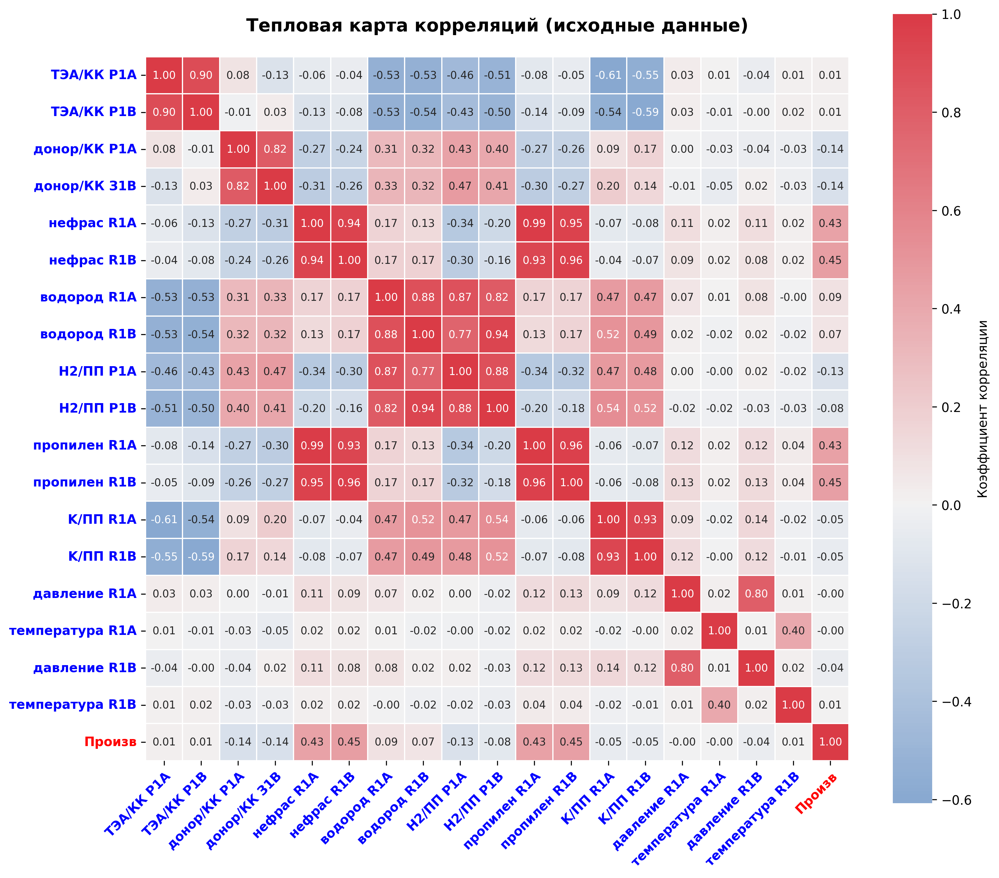

Все графики, карты, метрики и т.д. сохраняются в соответствующие папки. Для начальных данных это папка 01_raw_data.

## Фильтрация
Так как данные с производства очень разнообразны - предусматривается возможность нескольких способов удаления лишних данных:

- Ручное выставление границ (верхней и нижней), за пределами которых данные удаляются
- Межквартильный размах
- Медианное абсолютное отклонение - устойчив к выбросам
- Скользящее окно - для временных рядов - ловит локальные выбросы
- Производная - для поиска резких скачков
- Поиск пиков - для изолированных пиков
- Фильтр Савицкого-Голая - сглаживание и поиск отклонений
- Isolation Forest - машинное обучение (экспериментально)

  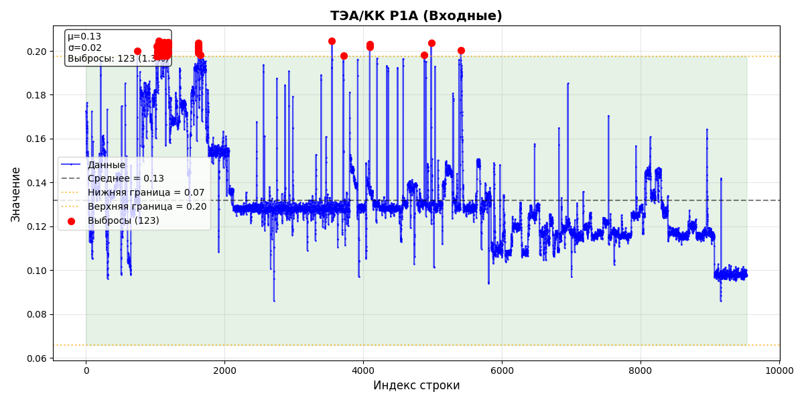

  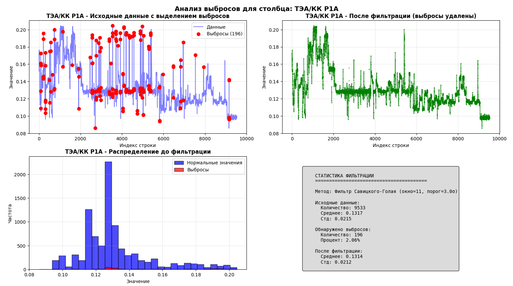

После обработки данных также выводятся графики для всех переменных и тепловая карта.
Данные после обработки, включая новый csv-файл сохраняются в папку 02_processed_data.

ВАЖНО ДЛЯ ОПТИМИЗАЦИИ: для того чтобы излишне не усложнять код - границы, в которых проводится поиск оптимальных значений - исторические. Поэтому заранее проверьте правильность диапазонов для используемых переменных.
## Скользящее окно

В случае, если данные делятся на какие-то этапы или участки или на временном отрезке есть данные, которые имеют очевидно меньший шум – можно воспользоваться скользящим окном - Это метод анализа временных рядов, при котором данные разбиваются на последовательные перекрывающиеся блоки (окна) фиксированного размера, которые сдвигаются с заданным шагом. Таким образом можно найти такой промежуток данных, в которых корреляция выше, чем на всем промежутке выгруженных данных.

  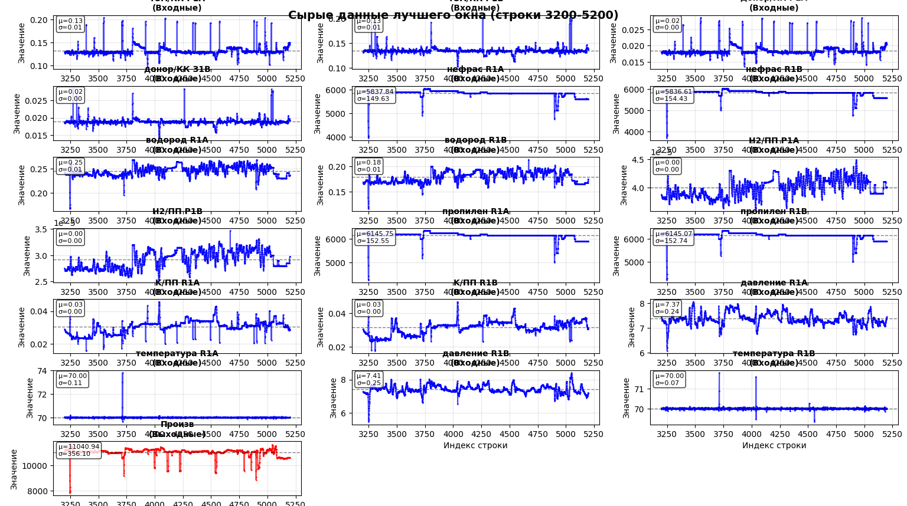

  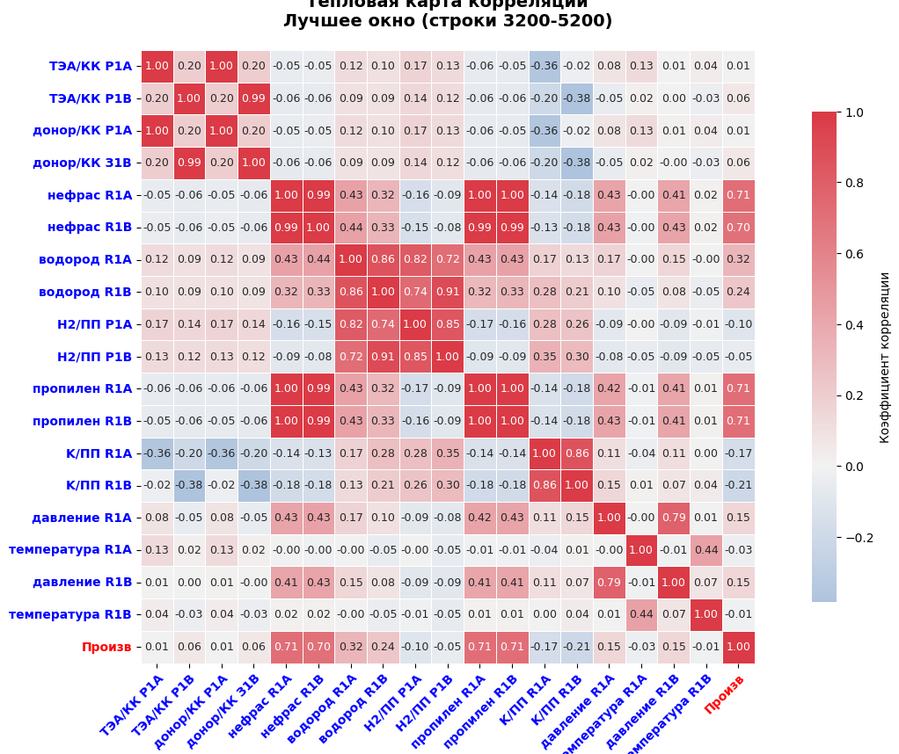

ВАЖНО, что корреляция отражает только линейные зависимости, поэтому стоит пользоваться этим методом только при уверенности в своих действиях.

Результаты работы скользящего окна сохраняются в папке 03_best_window.
## Построение модели

На данный момент в связи с большой нелинейностью данных в программе реализованы:

- Случайный лес
- XGBoost
- CatBoost

Изменить гиперпараметры моделей можно в config.py для увеличения точности предасказаний. Модели можно обучить по очереди и сравнить результаты.  
Данные по моделям сохраняются в папке 04_modeling_results.

### Случайнынй лес
Random Forest — ансамбль решающих деревьев, строящихся на случайных подвыборках данных и случайных подмножествах признаков. Итоговое предсказание — среднее по всем деревьям. Ключевые преимущества: устойчивость к переобучению за счёт бэггинга, отсутствие требования к масштабированию признаков, встроенная оценка важности признаков. Хорошо работает с нелинейными зависимостями и взаимодействиями. Недостаток: может давать кусочно-постоянные аппроксимации.

### XGBoost

XGBoost — градиентный бустинг, где каждое следующее дерево обучается на ошибках предыдущих. Отличается от Random Forest последовательным построением деревьев, а не независимым. Преимущества: высокая точность, встроенная L1/L2-регуляризация, эффективная работа с пропусками, гибкая настройка скорости обучения. Обычно показывает результаты лучше Random Forest на табличных данных. Недостаток: более склонен к переобучению без правильной регуляризации.

### CatBoost

CatBoost — это градиентный бустинг, где каждое следующее дерево обучается на ошибках предыдущих, но с ключевым отличием: все деревья симметричные (на каждом уровне все узлы используют один и тот же признак и порог). Преимущества: высокая устойчивость к переобучению, отличная работа «из коробки» (минимальная настройка), встроенная обработка категориальных признаков, высокая скорость предсказания. Обычно показывает стабильные результаты, близкие к XGBoost, но с меньшей склонностью к переобучению. Недостаток: симметричные деревья менее гибкие, что может дать чуть меньшую точность на очень сложных нелинейных зависимостях.

## Optuna

Для подбора гиперпараметров модели подключена библиотека Optuna - она проводит заданное количество итераций моделирования, повышая точность модели. Результаты оптимизации сохраняются в файле .json и могут быть перенесены в  config. На рисунке представлен результат подбора гиперпараметров для модели CatBoost.

  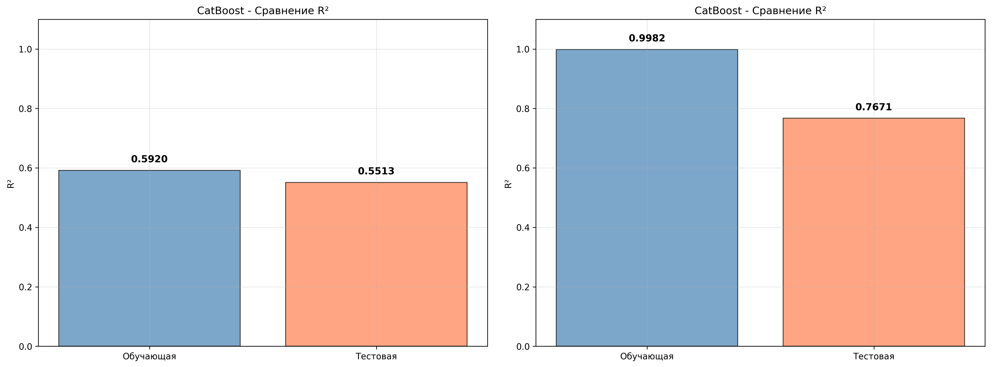

## Оптимизация

Оптимизация строится на основе данных выбранной модели. Для оптимизации на данный момент используется только генетический алгоритм. Для улучшения результатов оптимизации его параметры можно поменять в config.py.  
Пока оптимизация проводится только для одной входной величины, либо по всем параметрам, либо по n-количеству наиболее взаимосвязанных по мнению модели параметров.  
Оптимизация проводится в границах исторических данных, генетический алгоритм выдает один лучший результат оптимизации.

  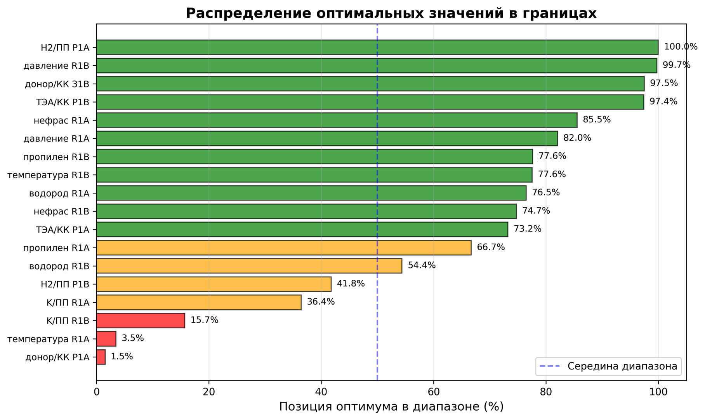

  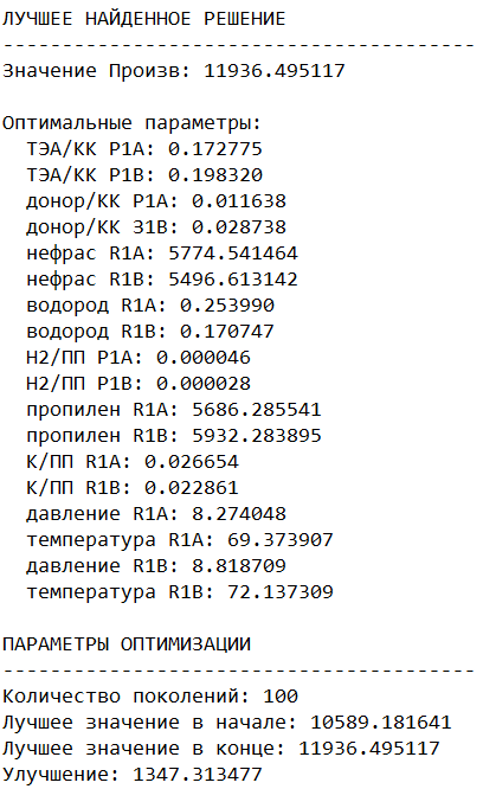

## Генерация сценариев
Для дальнейших задач (для калибровки модели в aspen или модели здесь) возможна генерация новых данных. Используется метод латинского гиперкуба.

  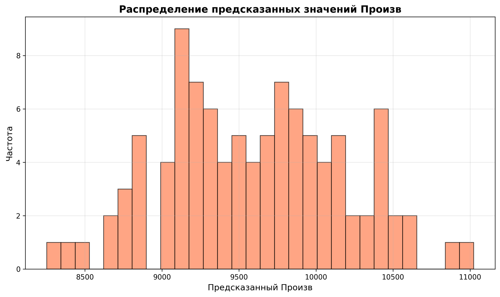

  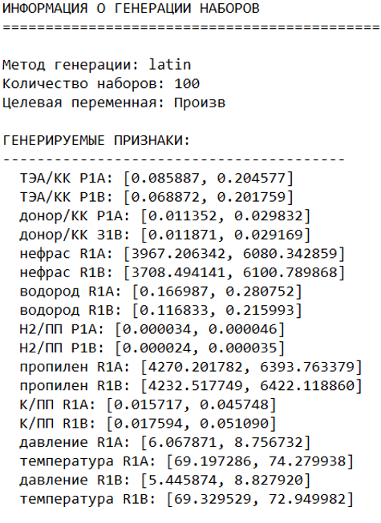

При генерации варьируются параметры, которые приняты моделью самыми влияющими на выходную величину (их количество изменяется в config.py и, технически, туда можно задать все параметры, которые подаются как входные).
